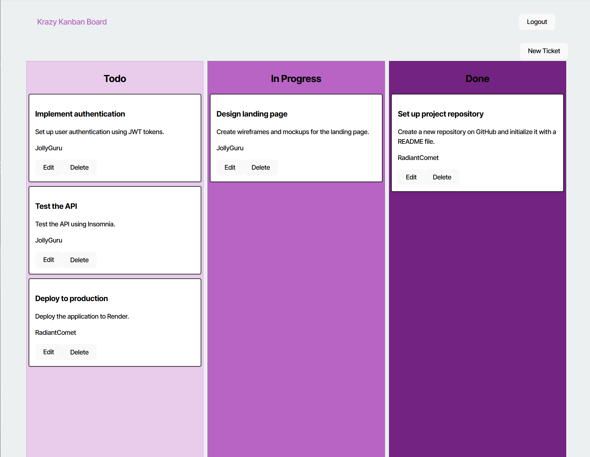

# Kanban_Board

## Description
Kanban_Board is a web application designed to help teams manage their tasks using the Kanban methodology. It allows users to create, update, and delete tickets, assign them to users, and track their progress through different stages such as Todo, In Progress, and Done.

## Table of Contents
- [Deployed Page](#deployed-page)
- [Usage](#usage)
- [License](#license)
- [Contributing](#contributing)
- [Questions](#questions)

## Deployed Page
[Kanban Board Deployed Page](https://kanban-board-3f0b.onrender.com)

## Usage

1. Login or create a new account.

2. Manage your tickets on the Kanban board.

3. Create New Tickets

## License
This project is licensed under the [MIT License](https://opensource.org/licenses/MIT).

## Contributing
Base files were provided by © 2023 edX Boot Camps

## Questions
For any questions, please contact me with the information below:

GitHub: [pink727](https://github.com/pink727)

Email: doc72789@gmail.com
____________________________________
© 2024 pink727. All Rights Reserved.
